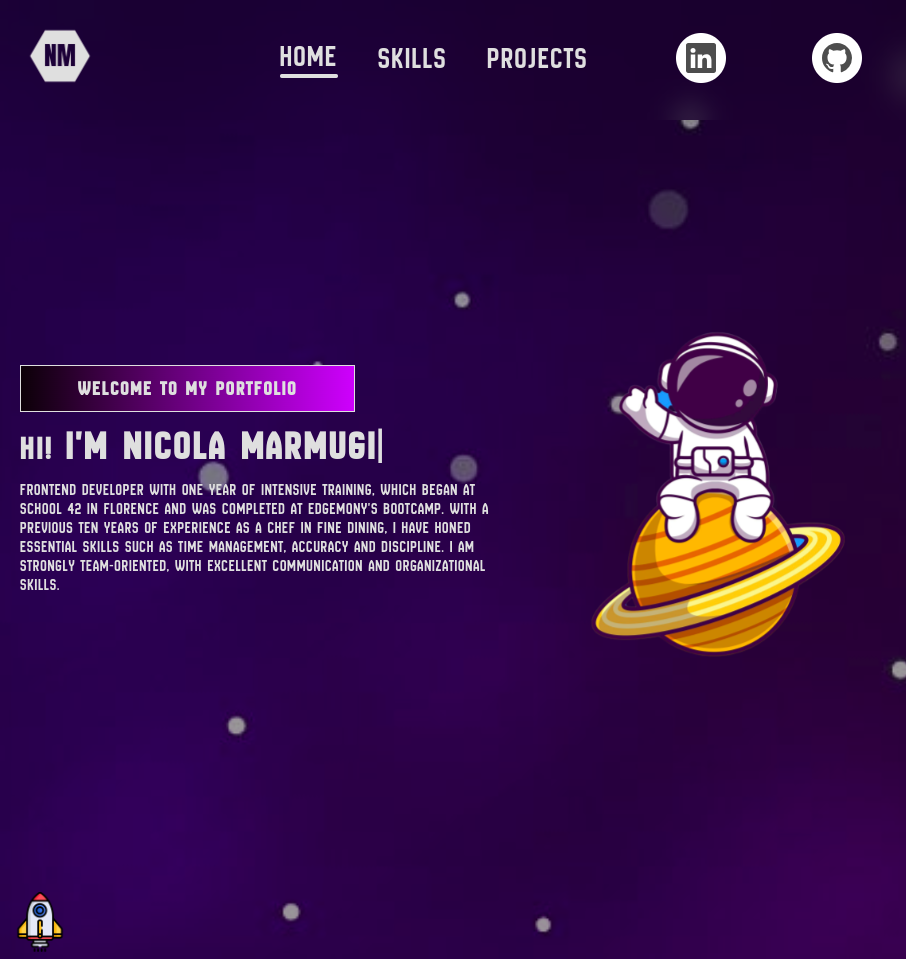

# 🎉 Benvenuto sul mio GitHub, sono Nicola Marmugi! 👋

## 🌟 Descrizione

Ciao! Sono **Nicola Marmugi**, una persona molto curiosa e con la voglia di imparare costantemente. Questa è la mia home page su GitHub. Qui potrai trovare informazioni su di me, i miei progetti e le tecnologie che utilizzo per esplorare nuove idee e sfide!

- 🌍 Visita il mio sito web: [Il Mio Portfolio](https://portfolio-nm-fawn.vercel.app/)

## ⚙️ Tecnologie Utilizzate

### Ecco alcune delle tecnologie che amo utilizzare:

    
    
    
    
    
    
    
    
    

## 📫 Contattami

Se desideri contattarmi, ecco come farlo:

- 📧 Email: [La Mia Mail](mailto:marmu1@hotmail.it)
- 💬 LinkedIn: [Il Mio Linkedin](https://www.linkedin.com/in/nicola-marmugi-2860b022a/)

---

Grazie per aver visitato la mia home page! 🎊 Spero di condividere e imparare nuove cose insieme! 😄

